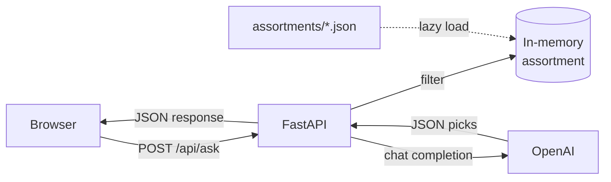

# Wine AI

En vinrekommendationsapp som kombinerar **Systembolagets sortimentdata** med **OpenAI GPT-modeller via API** för att föreslå viner som passar till maten du lagar — filtrerat på de butiker du har nära dig.



## Innehåll

- `backend/` — FastAPI-backend (Python 3.11+)
- `frontend/` — React + TypeScript + Tailwind (Vite)
- `assortments/` — JSON-export av Systembolagets sortiment per butik
  **(~1.5 GB — inte committad, se `assortments/README.md` för hur du fyller den)**
- `scripts/` — datauppdateringsverktyg (`update_data.py`)
- `legacy/` — original-prototypen (Flask + en stor `index.html`)

## Komma igång

### Förutsättningar

- Python 3.11 eller senare
- Node.js 18+ och npm (för frontend)
- OpenAI API-nyckel

### 1. Backend

```sh
cd backend
python -m venv .venv
.\.venv\Scripts\activate          # PowerShell
# eller: source .venv/bin/activate  # macOS/Linux

pip install -r requirements.txt

copy .env.example .env             # Windows
# eller: cp .env.example .env

uvicorn app.main:app --reload --port 5000
```

Backend lyssnar nu på `http://localhost:5000`. Hälsokoll: <http://localhost:5000/api/health>.

Kör testerna med:

```sh
python -m pytest
```

### 2. Frontend

```sh
cd frontend
npm install
npm run dev
```

Frontend startar på <http://localhost:5173> och proxar `/api/*` till backend automatiskt.

### 3. Använd appen

1. Öppna sidan i webbläsaren.
2. Klicka på menyknappen och välj minst en butik.
3. Justera filter (länder, pris, volym) om du vill.
4. Skriv vad du lagar — t.ex. *"pizza med skinka och svamp"* — och tryck **Skicka**.
5. Du får ett strukturerat svar med rekommenderade viner.

## Konfiguration

Alla inställningar läses från `backend/.env` (eller miljövariabler):

| Variabel           | Default                    | Beskrivning                                                 |
| ------------------ | -------------------------- | ----------------------------------------------------------- |
| `OPENAI_BASE_URL`  | `https://api.openai.com/v1`| OpenAI API-bas-URL                                          |
| `OPENAI_API_KEY`   | *(tom)*                    | Din OpenAI API-nyckel                                       |
| `OPENAI_MODEL`     | `gpt-5-mini`               | Modellnamn                                                  |
| `ASSORTMENTS_DIR`  | `../assortments`           | Mapp med sortiments-JSON                                    |
| `MAX_WINES_TO_LLM` | `80`                       | Maxantal viner som skickas i prompten                       |
| `CORS_ORIGINS`     | `http://localhost:5173`    | Tillåtna frontend-origins (kommaseparerade)                 |
| `LOG_LEVEL`        | `INFO`                     | `DEBUG`, `INFO`, `WARNING`, `ERROR`                         |
| `HOST` / `PORT`    | `0.0.0.0` / `5000`         | Bind-adress (om du kör `python -m app.main` direkt)         |

## CI/CD till GHCR

Workflow finns i `.github/workflows/build-and-push-ghcr.yml` och körs på push till `main` (samt manuellt via `workflow_dispatch`).

Den publicerar två images:

- `ghcr.io/<owner>/wineai-backend`
- `ghcr.io/<owner>/wineai-frontend`

Taggar som pushas:

- `latest` (endast default branch)
- `sha-<commit>`
- git-taggar (`v*`)

Frontend-image stödjer miljövariabeln `BACKEND_UPSTREAM` (default `backend:5000`) för att styra vart `/api` proxas.

### GitHub-inställningar

1. Se till att GitHub Actions är aktiverat för repot.
2. Workflown använder inbyggda `GITHUB_TOKEN` (ingen extra secret krävs för push till GHCR).
3. Om repot är privat och servern ska pulla images, skapa en PAT med `read:packages` på servern.

## Köra i containrar (2 tjänster)

Bygg lokalt:

```sh
docker build -f backend/Dockerfile -t wineai-backend:local .
docker build -f frontend/Dockerfile -t wineai-frontend:local .
```

Kör backend:

```sh
docker run --rm -p 5000:5000 \
  --env-file backend/.env \
  -v "$(pwd)/assortments:/app/assortments:ro" \
  wineai-backend:local
```

Kör enklast med Docker Compose (2 containrar):

```sh
export GHCR_OWNER=<ditt_github_namn_i_små_bokstäver>
docker compose pull
docker compose up -d
```

Frontend: <http://localhost:8080>  
Backend health: <http://localhost:5000/api/health>

## API

| Metod | Path             | Beskrivning                                       |
| ----- | ---------------- | ------------------------------------------------- |
| GET   | `/api/health`    | Hälsokoll                                         |
| GET   | `/api/stores`    | Alla icke-agent-butiker                           |
| GET   | `/api/countries` | Distinkta länder (filtrera via `?storeIds=...`)   |
| POST  | `/api/ask`       | Returnerar AI-valda vinrekommendationer (JSON)    |

`POST /api/ask` body:

```json
{
  "prompt": "pasta bolognese",
  "storeIds": ["0106"],
  "countries": ["Italien"],
  "priceRange": { "min": 0, "max": 500 },
  "volumeRange": { "min": 0, "max": 1500 }
}
```

Svaret returneras som JSON med `intro`, `recommendations` och eventuell `notes`.

## Uppdatera sortimentsdatan

`scripts/update_data.py` anropar en remote Systembolags-API-binär över SSH och skriver om `assortments/*.json`. Det kräver att du har den miljön uppsatt — för de flesta räcker det att använda redan committad data.

## Vad har förbättrats jämfört med originalet (`legacy/`)

- **Backend**:
  - FastAPI + Pydantic istället för Flask + handrullad validering
  - Strukturerade rekommendationer från OpenAI via JSON-schema
  - In-memory cache + O(1) deduplicering (gamla koden var O(n²))
  - Strukturerad logging, miljö-config, riktig felhantering
  - 11 enhetstester
- **Frontend**:
  - React + TypeScript + Tailwind, uppdelat i komponenter och hooks
  - Markdown-rendering av AI-svaren
  - localStorage-persistens av filterval
  - Dynamisk landlista från sortimentet (inte hårdkodad)
  - Tillgängliga ARIA-labels, fokus-stilar, ESC-tangent stänger sidomenyn
  - Mobilvänlig responsiv layout
- **Övrigt**:
  - Top-level-koden i `callAPIinC.py` (som körde varje gång modulen importerades) är borta
  - Stavfel som `promtAI`/`awnser` rättade
  - Död kod (`store-selector.js`) borttagen
